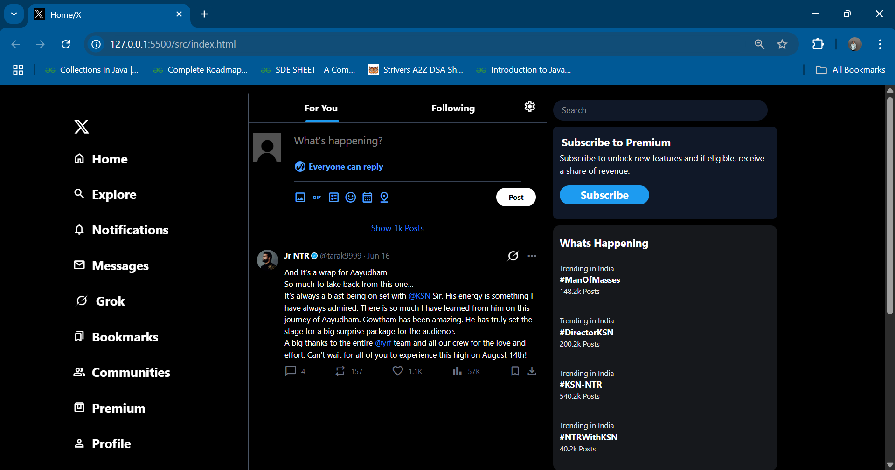
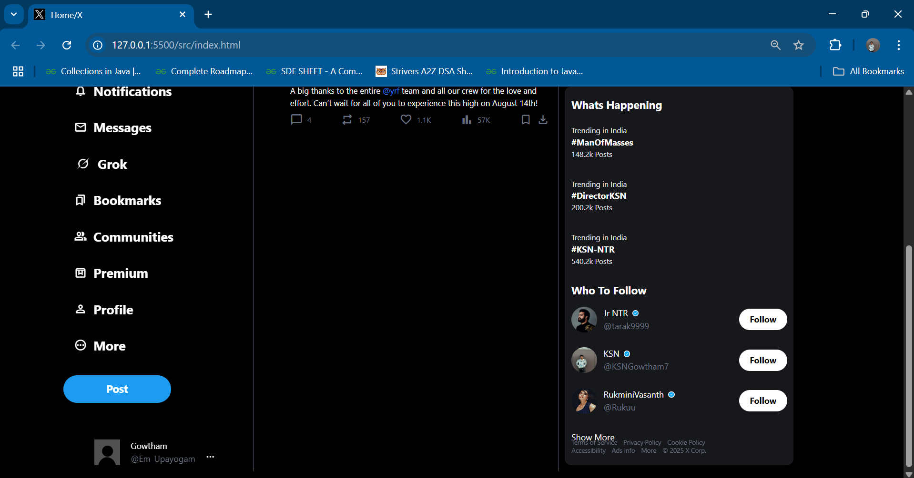

# 🐦 Twitter Clone (X) - HTML + Tailwind CSS

A beautiful clone of the Twitter (X) user interface, built using pure HTML and styled with Tailwind CSS. This project mimics the layout and appearance of the modern Twitter web app, including sidebar navigation, tweet feed, trending topics, and user suggestions.

## 📸 Preview

> Screenshots show the responsive dark-mode UI inspired by Twitter/X

---

## 🛠️ Technologies Used

- **HTML5**
- **Tailwind CSS**
- **Google Fonts & Material Icons** (for UI consistency)

---

## 📁 Project Structure

